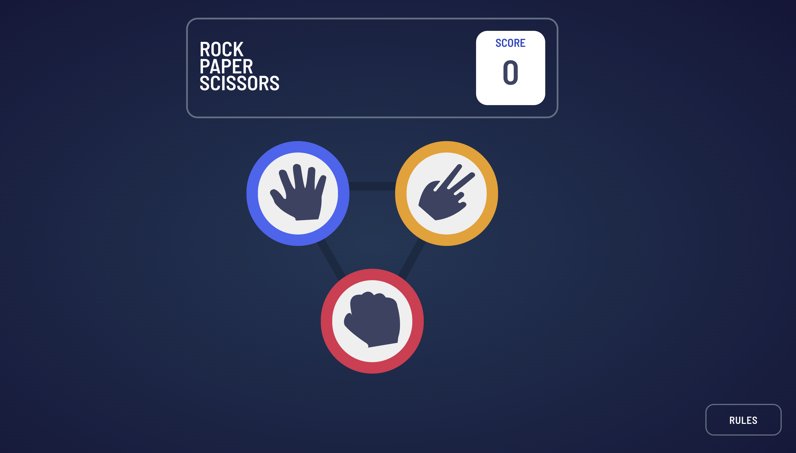

# Frontend Mentor - Rock, Paper, Scissors solution

This is a solution to the [Rock, Paper, Scissors challenge on Frontend Mentor](https://www.frontendmentor.io/challenges/rock-paper-scissors-game-pTgwgvgH). Frontend Mentor challenges help you improve your coding skills by building realistic projects. 

## Table of contents

- [Overview](#overview)
  - [The challenge](#the-challenge)
  - [Screenshot](#screenshot)
  - [Links](#links)
- [My process](#my-process)
  - [Built with](#built-with)
  - [What I learned](#what-i-learned)
  - [Continued development](#continued-development)
- [Author](#author)

## Overview

### The challenge

Users should be able to:

- View the optimal layout for the game depending on their device's screen size
- Play Rock, Paper, Scissors against the computer
- Maintain the state of the score after refreshing the browser _(optional)_
- **Bonus**: Play Rock, Paper, Scissors, Lizard, Spock against the computer _(optional)_

### Screenshot




### Links

- Live Site URL: (https://rock-paper-scissors-chi-pink.vercel.app/)

## My process

### Built with

- Semantic HTML5 markup
- CSS custom properties
- Flexbox
- CSS Grid
- Mobile-first workflow
- [React](https://reactjs.org/) - JS library
- [Material UI](https://mui.com/material-ui/) - Styled React Components (used for Rules modal)

### What I learned

This project required the use of ternary operators and timeout functions. Although I had some prior experience with these, this project solidified these skills for me. This project was built all within one component, so the use of ternary operators to show or not show specific content was incredibly necessary. In order to keep the player of the game on their toes, I used the timeout function to display a question mark image before showing what the computer decided as it's choice. 

```js
<h3>YOU PICKED</h3>
    {rockClicked ? (
      <button className="gameButton rock" style={{margin:'0px'}}>
        
      </button>
      ) : null}
    {paperClicked ? (
      <button className="gameButton paper" style={{margin:'0px'}}>
        
      </button>
      ) : null}
    {scissorsClicked ? (
      <button className="gameButton scissors" style={{margin:'0px'}}>
        
      </button>
    ) : null}
```

```js
  useEffect(() => {
    setHousePick(questionMark)
    const timer = setTimeout(() => {
      let pick = Math.floor(Math.random() * 3) + 1;
      if (pick === 1) {
        setHousePick(paper);
        setHouse("paper");
      }
      if (pick === 2) {
        setHousePick(rock);
        setHouse("rock");
      }
      if (pick === 3) {
        setHousePick(scissors);
        setHouse("scissors");
      }
    }, 1000);
    return () => clearTimeout(timer);
  }, [playerPick]);
```

### Continued development

As mentioned in the overview section, there are two optional challenges: maintaining the state of the score after refreshing the browser, and playing rock, paper, scissors, lizard, spick against the computer. As I continue to develop this game, I plan to add the maintaining state functionality and additional game play option.

I'd also like the user to be able to pick which version of the game they would like to play. 

## Author

- Website - [Sadie Southworth](https://sadiesouthworth.com)
- LinkedIn - (https://www.linkedin.com/in/sadiesouthworth/)